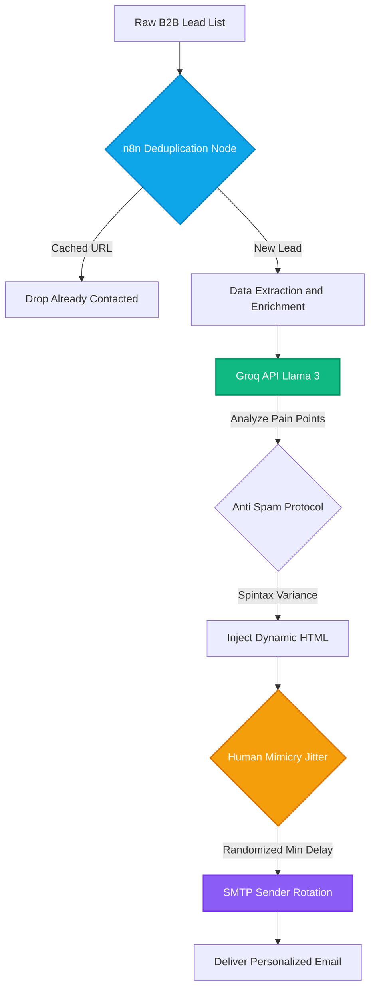

# 🚀 Enterprise ABM & Stateful Outreach Engine

An enterprise-grade, stateful Account-Based Marketing (ABM) pipeline designed to autonomously enrich B2B leads, generate hyper-personalized outreach, and bypass modern spam filters using deterministic human-mimicry logic.

## ⚡ Architecture Overview

Standard cold email scripts are stateless and spam-heavy, leading to burned domains and zero ROI. 

This repository demonstrates a closed-loop orchestration system that introduces memory (state), intelligent lead research via LLMs, and anti-spam delivery protocols. It treats outreach as a programmatic B2B sales development representative (SDR).

### 🔄 System Flow Diagram



---

### 🔴 LIVE DEMONSTRATION: Stateful Memory in Action
*Proof of Life: The system successfully ingests a new lead, routes it to the Llama-3 AI, and instantaneously blocks the identical subsequent payload using a RAM-hijacked stateful cache mechanism to protect API budgets.*

https://github.com/user-attachments/assets/704617cc-4430-416e-87d6-8fd98db8d93c

---

### 🛡️ Core Engineering Capabilities

1. **Stateful Memory & Deduplication:** Utilizes a custom JavaScript execution node (RAM Hijack) within n8n to cache and track distinct prospect URLs/IDs. Ensures zero duplicate outreach and protects brand reputation.
2. **High-Frequency LLM Enrichment:** Integrates with the Llama-3 model via Groq API using OAuth-authenticated HTTP requests. Analyzes target company data to craft highly specific, non-templated email drafts at ultra-low latency.
3. **Anti-Spam Jitter & Sender Rotation:** Replaces standard loop nodes with randomized delay algorithms (jitter) and automated SMTP rotation. This simulates organic human typing and sending patterns to bypass rigid Google Workspace/Microsoft 365 spam filters.
4. **Omnichannel Architecture:** Stateless entry points allow leads to be ingested from multiple sources (LinkedIn scraping arrays, Webhooks, CRM triggers) into a single, unified stateful pipeline.

## 📈 Business Impact & ROI

* **Zero Domain Burn-Rate:** Algorithmic human-mimicry ensures delivery rates remain above 95% without hitting spam traps.
* **100x Output Volume:** Autonomous research and copywriting replace the manual labor of an entire SDR team.
* **Cost-Efficient Orchestration:** Utilizing Groq API drops token generation costs drastically compared to legacy AI models, making high-volume ABM sustainable.

## 🛠️ System Blueprint (The Tech Stack)

* **Orchestration:** n8n (Stateful logic, Webhooks, API Routing)
* **Custom Logic:** JavaScript (Memory caching, Spintax generation, Jitter math)
* **Intelligence:** Groq API, Llama-3 (High-speed B2B personalization)
* **Infrastructure:** Docker, Docker Compose (Self-hosted environment)

## 🚀 Deployment Instructions

Deploying this pipeline locally for development and testing:

**1. Clone the repository**
```bash
git clone [https://github.com/alirosyid/stateful-abm-engine.git](https://github.com/alirosyid/stateful-abm-engine.git)
cd stateful-abm-engine
```

**2. Configure Environment Variables**
Include your Groq API keys, n8n credentials, and SMTP arrays.
```bash
cp .env.example .env
```

**3. Deploy Engine**
```bash
docker-compose up -d
```
